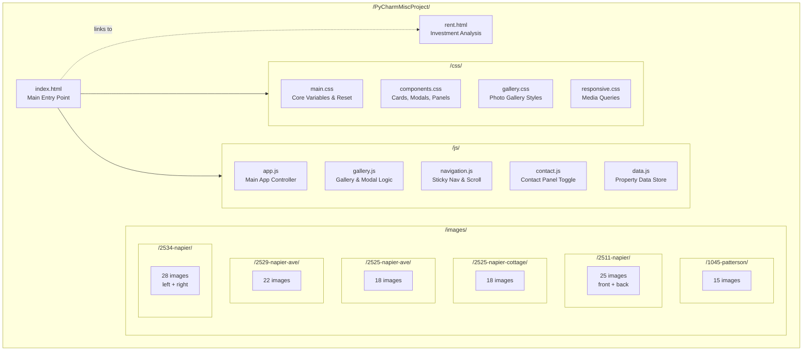
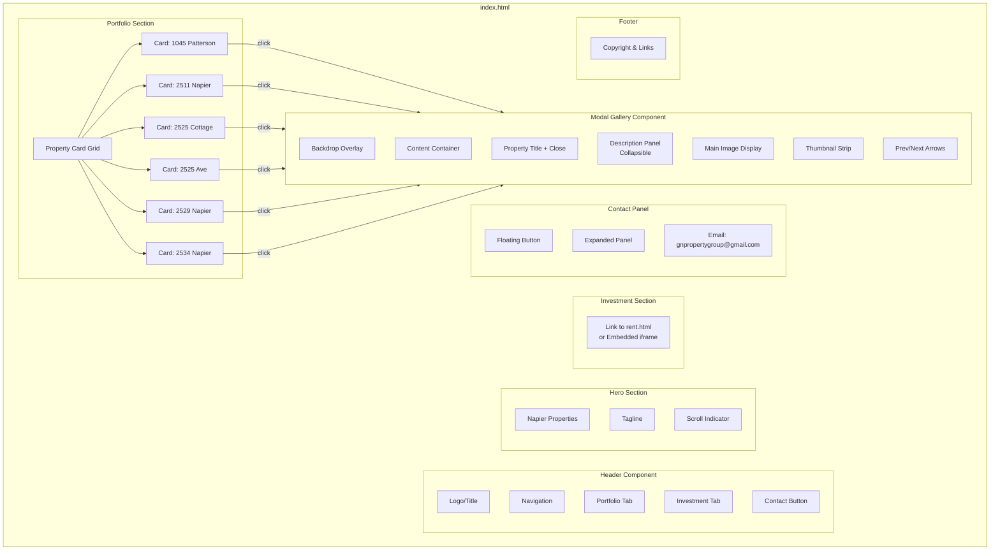
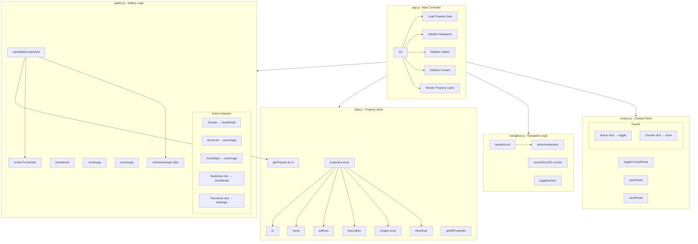
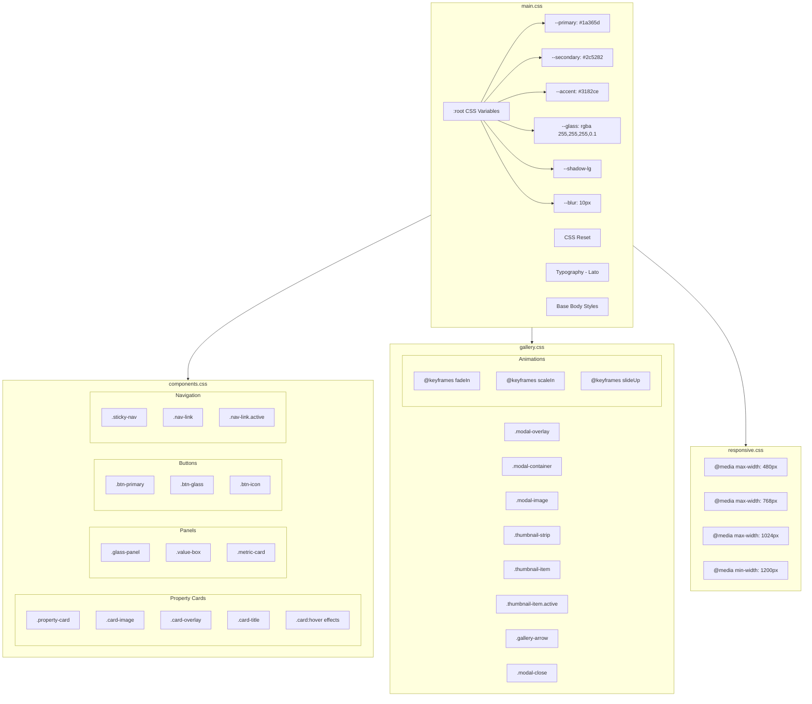
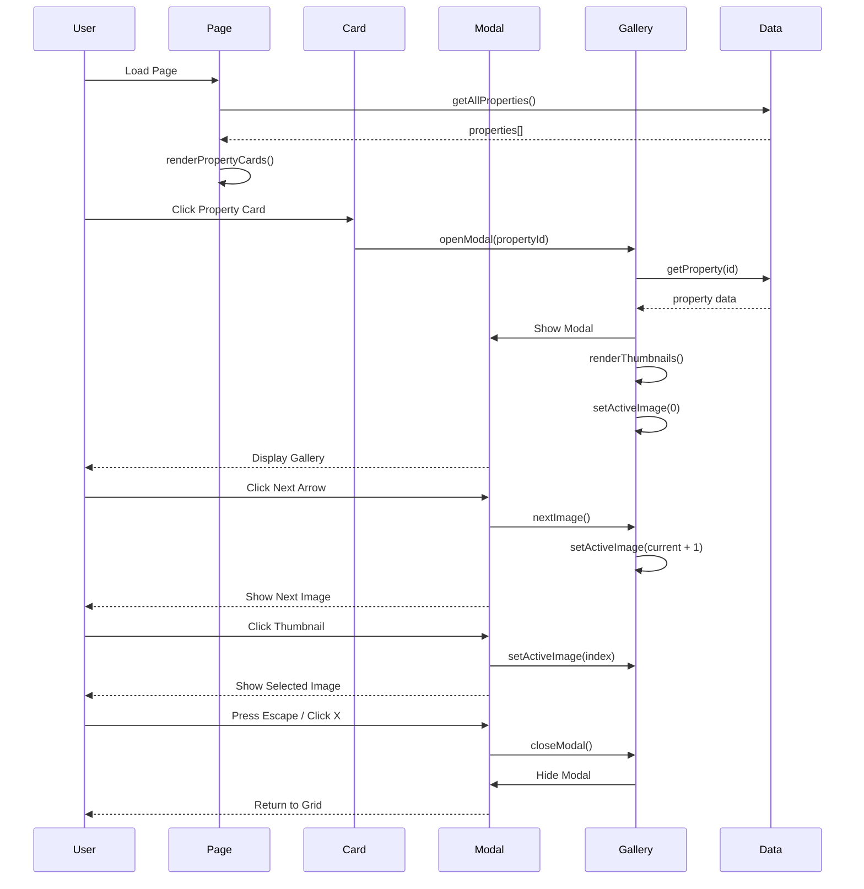
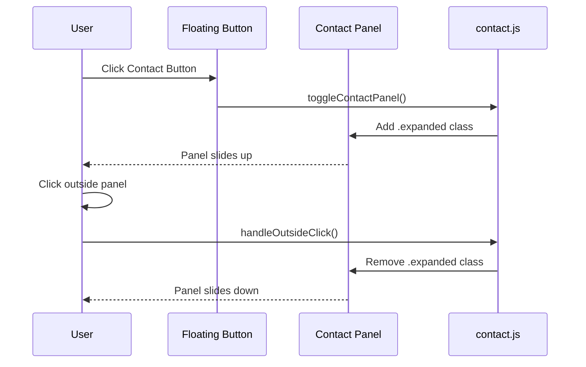
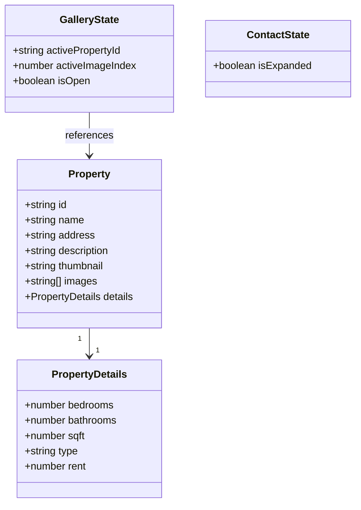

# Napier Properties - Site Architecture

## File Structure

## Component Hierarchy

## JavaScript Module Logic

## CSS Module Structure

## User Interaction Flow

## Contact Panel Flow

## Data Structure

## Build Order

```mermaid
gantt
    title Implementation Order
    dateFormat X
    axisFormat %s

    section Structure
    Create folder structure     :a1, 0, 1
    Create index.html skeleton  :a2, after a1, 2

    section CSS
    main.css variables & reset  :b1, after a2, 2
    components.css cards/panels :b2, after b1, 3
    gallery.css modal styles    :b3, after b2, 2
    responsive.css breakpoints  :b4, after b3, 1

    section JavaScript
    data.js property store      :c1, after a2, 2
    navigation.js               :c2, after c1, 1
    contact.js                  :c3, after c2, 1
    gallery.js modal logic      :c4, after c3, 3
    app.js main controller      :c5, after c4, 2

    section Content
    Collect property descriptions :d1, after c5, 2
    Copy/organize images          :d2, after d1, 2

    section Testing
    Test all features            :e1, after d2, 2
```

